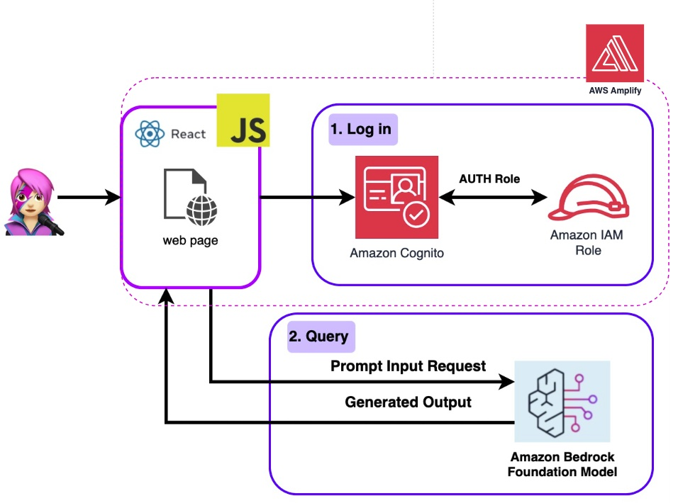
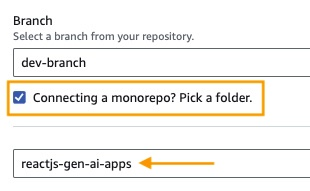
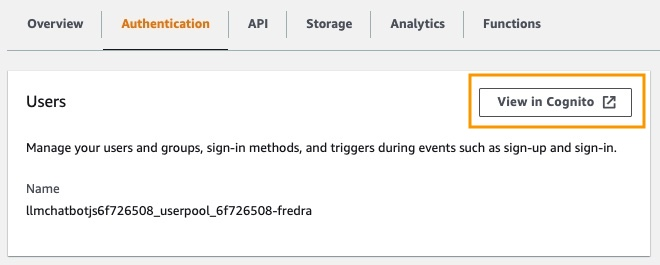
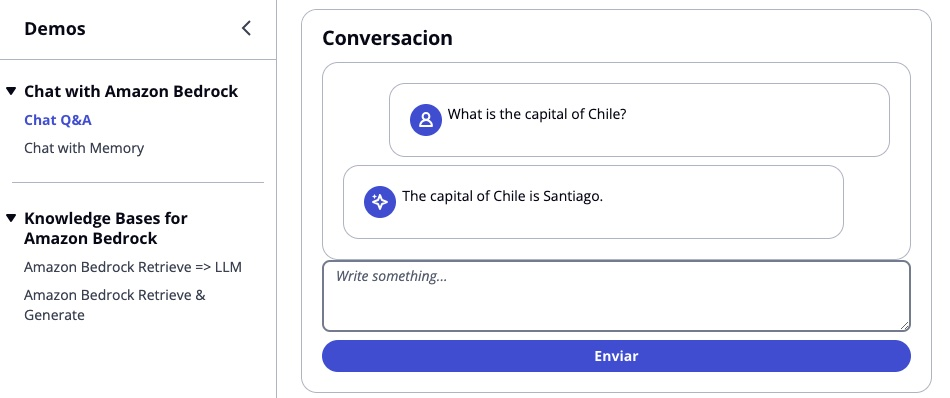

# Building Reactjs generative AI apps with Amazon Bedrock Javascript SDK

Integrating generative AI into existing applications presents challenges. Many developers have limited experience in training foundations models, but the aim is to integrate generative AI capabilities with minimal code changes.

To solve this, we created an application that integrates the power of generative AI with a call to the [Amazon Bedrock API](https://docs.aws.amazon.com/bedrock/latest/APIReference/welcome.html) from a web application in React/JavaScript. With no middleware, eliminating the barrier of incorporating AI generation through minimal code integration.

This blog will teach you how to use [Amazon Cognito](https://aws.amazon.com/pm/cognito/) credentials to access the [Amazon Bedrock](https://aws.amazon.com/bedrock/) API in a react-based application with JavaScript and the [CloudScape](https://cloudscape.design/) design system. Built and deployed using [AWS Amplify](https://aws.amazon.com/amplify/).




## How Does This Application Work?

In the [repository of this application](https://github.com/build-on-aws/building-reactjs-gen-ai-apps-with-amazon-bedrock-javascript-sdk/), you will find the code ready to deploy the backend and frontend.

✅ **Backend:** made up with Amazon Cognito, with an [AWs Identity and Access ManagemenRole](https://docs.aws.amazon.com/es_es/IAM/latest/UserGuide/id_roles.html)(IAM Role) that contains the policy with the permissions to invoke Amazon Bedrock.

```
{ policyName: "amplify-permissions-custom-resources",
            policyDocument: {
                Version: "2012-10-17",
                Statement: [
                    {
                        Resource: "*",
                        Action: ["bedrock:InvokeModel*", "bedrock:List*", "bedrock:Retrieve*"],
                        Effect: "Allow",
                    }
                ]
            }
        }
```

> Code: [IAM Role Code](https://github.com/elizabethfuentes12/building-a-gen-ai-personal-assistant/blob/main/reactjs-gen-ai-apps/amplify/backend/awscloudformation/override.ts)

✅ **Frontend:** made up React, JavaScript and the [CloudScape](https://cloudscape.design/)Scape design system.

This application comprises 3 demos:

-	Chat with Amazon Bedrock
-	Knowledge Bases for Amazon Bedrock


All demos have in common the use of the [BedrockRuntimeClient](https://docs.aws.amazon.com/AWSJavaScriptSDK/v3/latest/client/bedrock-runtime/) API to initialize Bedrock and [BedrockAgentRuntimeClient](https://docs.aws.amazon.com/AWSJavaScriptSDK/v3/latest/Package/-aws-sdk-client-bedrock-agent-runtime/Class/BedrockAgentRuntimeClient/) API to invoke the Amazon Bedrock client.

``` Javascript
import { BedrockAgentClient} from "@aws-sdk/client-bedrock-agent"
import { BedrockAgentRuntimeClient} from "@aws-sdk/client-bedrock-agent-runtime"
```

[Bedrock](https://aws.amazon.com/bedrock/) is fully managed service for building generative AI applications, offers a selection of high-performing foundation models (FMs) that can be loaded and queried.

This app use [anthropic.claude-instant-v1](https://aws.amazon.com/bedrock/claude/)" model hosted on Bedrock. It sets up the region, enables streaming responses, passes the auth session credentials from the [user pool authentication](https://docs.aws.amazon.com/cognito/latest/developerguide/amazon-cognito-user-pools-authentication-flow.html) and configures the model to sample up to 1000 tokens for more casual and varied language using a temperature of 1.

```Javascript
export const getModel = async () => {
    const session = await fetchAuthSession(); //To get user credential from React
    const model = new Bedrock({
        model: "anthropic.claude-instant-v1",
        region: "us-east-1",
        streaming: true,
        credentials: session.credentials,
        modelKwargs: { max_tokens_to_sample: 1000, temperature: 1 },
    });
    return model;
};
```

> **Code** --> [llmLib.js](https://github.com/build-on-aws/building-reactjs-gen-ai-apps-with-amazon-bedrock-javascript-sdk/blob/main/reactjs-gen-ai-apps/src/llmLib.js)

We'll walk you through each demo group to highlight their differences.

### Chat With Amazon Bedrock


Here you will talk directly with the Large Language Model (LLM) implemented by the Bedrock API through a LangChain agent (or [chain](https://js.langchain.com/docs/modules/chains/)), in two different ways: 

**- Chat Q&A:** Send prompt input Rrequest and the model responds with a generated output.


**- Chat with Memory:** Send prompt input Rrequest with the with previous messages (if they exist) and the model responds with a generated output. 


This chat is built with a LangChain agent by invoking [Buffer Memory](https://js.langchain.com/docs/modules/memory/types/buffer_memory_chat). There are other types of memory, learn more in [Working With Your Live Data Using LangChain](https://community.aws/posts/working-with-your-live-data-using-langchain). 

To set up this demo, it is necessary to instantiate the [Bedrock](https://js.langchain.com/docs/integrations/llms/bedrock) library for Lagnchain, [ConservationChain](https://js.langchain.com/docs/modules/chains/) to manage the conversation and [BufferMemory](https://js.langchain.com/docs/modules/memory/types/buffer) to invoke memory usage.

``` Javascript
import { Bedrock } from "@langchain/community/llms/bedrock/web";
import { ConversationChain} from "langchain/chains";
import { BufferMemory } from "langchain/memory";
```

[Claude](https://aws.amazon.com/bedrock/claude/) has been trained to think in indicators of who is talking like [Human: and Assistant](https://docs.anthropic.com/claude/docs/human-and-assistant-formatting):, so we must store the chat memory that way for the model to understand who each part of the conversation belongs to.

With a `chat_history` object to load messages into a `BufferMemory` the state of past conversations passes into the context of the current one. 

```Javascript
const memory = new BufferMemory({ humanPrefix: "H",  memoryKey:"chat_history"});
```

### Knowledge Bases for Amazon Bedrock

In this demo, you will make question to the [Knowledge Bases for Amazon Bedrock](https://aws.amazon.com/bedrock/knowledge-bases/) taking advantage of retrieval augmented generation (RAG). You must have at least one knowledge base created, do it by following [Create a knowledge base guide](https://docs.aws.amazon.com/bedrock/latest/userguide/knowledge-base-create.html).

Questions to the Knowledge Bases for Amazon Bedrock will be asked in two ways:


**- Amazon Bedrock Retrieve => LLM:** 


List the knowledge bases with [ListKnowledgeBasesCommand](https://docs.aws.amazon.com/AWSJavaScriptSDK/v3/latest/Package/-aws-sdk-client-bedrock-agent/Class/ListKnowledgeBasesCommand/)as follows:

```Javascript
import { ListKnowledgeBasesCommand } from "@aws-sdk/client-bedrock-agent"

export const getBedrockKnowledgeBases = async () => {
    const session = await fetchAuthSession()
    const client = new BedrockAgentClient({ region: "us-east-1", credentials: session.credentials })
    const command = new ListKnowledgeBasesCommand({})
    const response = await client.send(command)
    return response.knowledgeBaseSummaries
}
```
The [AmazonKnowledgeBaseRetriever](https://js.langchain.com/docs/integrations/retrievers/bedrock-knowledge-bases) Langchain class retrieves information from the knowledge base, from the `topK` tokens. 

```Javascript
import { AmazonKnowledgeBaseRetriever } from "@langchain/community/retrievers/amazon_knowledge_base";

export const getBedrockKnowledgeBaseRetriever = async (knowledgeBaseId) => {
    const session = await fetchAuthSession();

    const retriever = new AmazonKnowledgeBaseRetriever({
        topK: 10,
        knowledgeBaseId: knowledgeBaseId,
        region: "us-east-1",
        clientOptions: { credentials: session.credentials }
    })

    return retriever
}
```

The most suitable answer is then given by the Langchain agent [ConversationalRetrievalQAChain](https://api.js.langchain.com/classes/langchain_chains.ConversationalRetrievalQAChain.html) class.

```Javascript
import { ConversationalRetrievalQAChain } from "langchain/chains";

export const getConversationalRetrievalQAChain = async (llm, retriever, memory) => {

    const chain = ConversationalRetrievalQAChain.fromLLM(
        llm, retriever = retriever)
    chain.memory = memory

    chain.questionGeneratorChain.prompt.template = "Human: " + chain.questionGeneratorChain.prompt.template +"\nAssistant:"

    chain.combineDocumentsChain.llmChain.prompt.template = `Human: Use the following pieces of context to answer the question at the end. If you don't know the answer, just say that you don't know, don't try to make up an answer. 

{context}

Question: {question}
Helpful Answer:
Assistant:`

return chain
}
```


**- Amazon Bedrock Retrieve & Generate:** 


Bedrock is initialized with [BedrockAgentRuntimeClient](https://docs.aws.amazon.com/AWSJavaScriptSDK/v3/latest/Package/-aws-sdk-client-bedrock-agent-runtime/Class/BedrockAgentRuntimeClient/) and with [RetrieveAndGenerateCommand](https://docs.aws.amazon.com/AWSJavaScriptSDK/v3/latest/Package/-aws-sdk-client-bedrock-agent-runtime/Class/RetrieveAndGenerateCommand/) queries a knowledge base and a foundation model generates responses based on the retrieved results. In this demo Langchain is no needed.

```Javascript
import { BedrockAgentRuntimeClient, RetrieveAndGenerateCommand } from "@aws-sdk/client-bedrock-agent-runtime"

export const ragBedrockKnowledgeBase = async (sessionId, knowledgeBaseId, query) => {
    const session = await fetchAuthSession()
    const client = new BedrockAgentRuntimeClient({ region: "us-east-1", credentials: session.credentials });
    const input = {
        input: { text: query }, // KnowledgeBaseQuery
        retrieveAndGenerateConfiguration: {
            type: "KNOWLEDGE_BASE",
            knowledgeBaseConfiguration: {
                knowledgeBaseId: knowledgeBaseId,
                modelArn: "arn:aws:bedrock:us-east-1::foundation-model/anthropic.claude-v2:1", // Arn of a Bedrock model
            },
        }
    }

    if (sessionId) {
        input.sessionId = sessionId
    }

    const command = new RetrieveAndGenerateCommand(input);
    const response = await client.send(command)
    return response
}
```


## Let's Build React Generative AI Application With Amazon Bedrock Javascript SDK

### Step 1 - Enable AWS Amplify Hosting:

The application is built with [AWS Amplify](https://docs.aws.amazon.com/amplify/latest/userguide/welcome.html), and to deploy it in your account associate the repo with your GitHub account to be able to connect it to Amplify and launch the application, for that [fork](https://docs.github.com/pull-requests/collaborating-with-pull-requests/working-with-forks/fork-a-repo) this repo: 


```
https://github.com/build-on-aws/building-reactjs-gen-ai-apps-with-amazon-bedrock-javascript-sdk/forks
```

Create a [New branch](https://docs.github.com/en/desktop/making-changes-in-a-branch/managing-branches-in-github-desktop): `dev-branch`.

Then follow the steps in [Getting started with existing code guide](https://docs.aws.amazon.com/amplify/latest/userguide/getting-started.html). 

In **Step 1 Add repository branch**, select main branch and **Connecting a monorepo? Pick a folder** and enter `reactjs-gen-ai-apps` as a root directory.



For the next Step, **Build settings**, select `building-a-gen-ai-gen-ai-personal-assistant-reactjs-apps(this app)` as App name, in Enviroment select **Create a new envitoment** and write `dev`


If there is no existing role, create a new one to service Amplify.


In the case of creating a new role, select **Amplify** as a service and select **Amplify - Backend Deployment**.


### Step 2 - Access to the AWS Amplify App:

Once the application has been deployed, go to the link in the application, which is located under the white box.


When you enter the link, the Sing In window will appear, so you must create a  [Amazon Cognito User Pool](https://docs.aws.amazon.com/cognito/latest/developerguide/cognito-user-identity-pools.html) User.


#### ✅ How To Create A User

In the App go to **Backend environments** and click on Authentication. 


Then, under Authentication, click **View in Cognito**:



In the **User Pool**, click the name of your user pool and **Create User**.

[Create your user](https://docs.aws.amazon.com/cognito/latest/developerguide/managing-users.html?icmpid=docs_cognito_console_help_panel) and then sing in.

> **Note:** You can create the user directly from the application by changing False `hideSignUp: false` in [App.jsx](https://github.com/elizabethfuentes12/building-a-gen-ai-personal-assistant/blob/main/reactjs-gen-ai-apps/src/App.jsx), but this can introduce a security flaw by giving anyone access to it.

## Let's Try React Generative AI Application With Amazon Bedrock Javascript SDK

Before you can use a foundation model in Amazon Bedrock, you must request access to it. Follow the step in [Add model access guide](https://docs.aws.amazon.com/bedrock/latest/userguide/model-access.html). 

Go to the application link and sign in with the user you created.

🤖🚀 Try and test the app! 




## Conclusion

In this blog, we discuss how to create a React application that can directly access the Amazon Bedrock API using Amazon Cognito for authentication. Integrating generative AI services like Bedrock into a React interface securely can be achieved by leveraging AWS managed services like Cognito and Amplify. 

With this you can incorporate powerful Amazon Bedrock generative AI capabilities into new and existing React applications. This allows developers to focus on creating engaging conversation experiences, knowledge bases, and agent demos instead of managing authentication and authorization themselves.

## 🚀 Some links for you to continue learning and building:

- [Amplify Workshops](https://workshops.aws/categories/Amplify)
- [Amplify JavaScript Sample Applications](https://github.com/aws-amplify/amplify-js-samples)
- [Actions and scenarios using SDK for JavaScript](https://docs.aws.amazon.com/sdk-for-javascript/v3/developer-guide/javascript_code_examples_categorized.html)

## Security

See [CONTRIBUTING](CONTRIBUTING.md#security-issue-notifications) for more information.

## License

This library is licensed under the MIT-0 License. See the LICENSE file.

